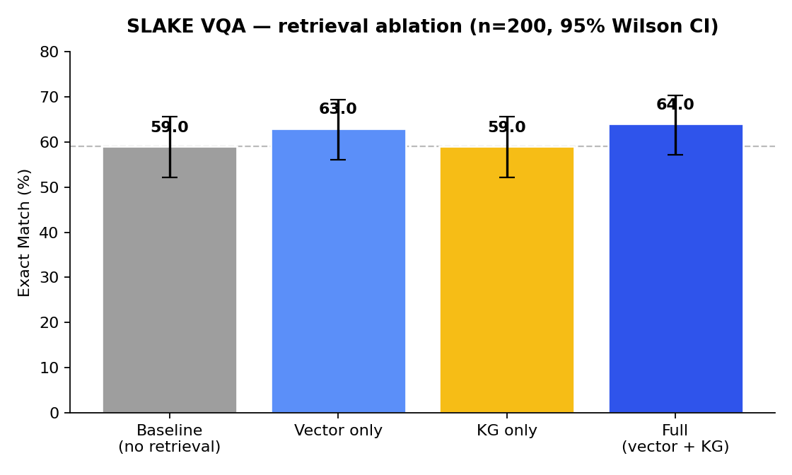
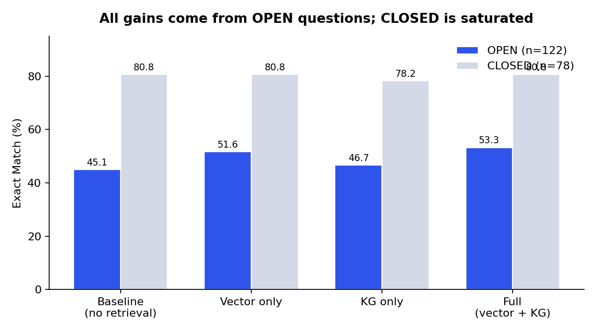
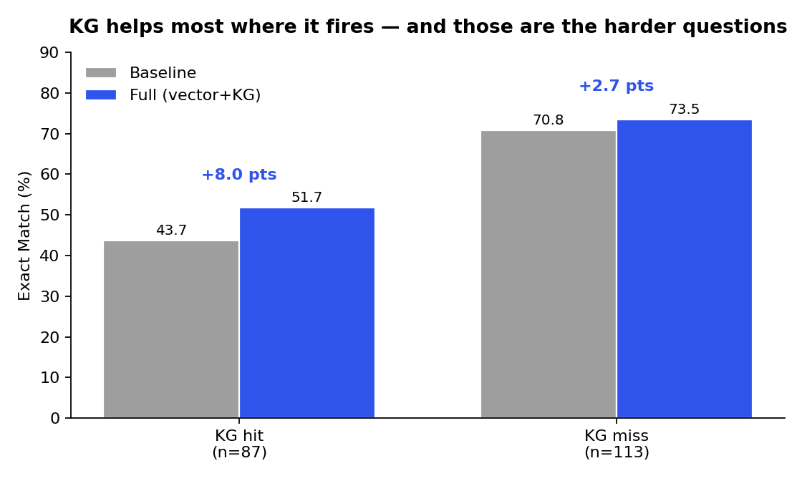

# KG-MMRAG

**Knowledge Graph–Augmented Multimodal Retrieval-Augmented Generation for Medical Imaging**

Research conducted at IDEAS-TIH, Indian Statistical Institute (ISI) Kolkata.

KG-MMRAG grounds medical visual question answering in two complementary retrieval paths: a dense multimodal index over image–question pairs (CLIP + FAISS) and a structured clinical knowledge graph (networkx) built from SLAKE's bundled knowledge base. Evidence from both paths is fused and passed to MedGemma for generation.

---

## Results

**SLAKE English VQA · 200 test questions · MedGemma-4B-IT · greedy decoding · seed 42**

### Main ablation

| Configuration | Exact Match | 95% CI | Token F1 | Δ EM vs. baseline |
|---|---|---|---|---|
| Baseline (no retrieval) | 59.0 | [52.1, 65.6] | 62.89 | — |
| Vector only | 63.0 | [56.1, 69.4] | 67.89 | **+4.0** ✳ |
| KG only | 59.0 | [52.1, 65.6] | 62.75 | +0.0 |
| **Full (vector + KG)** | **64.0** | **[57.1, 70.3]** | **68.78** | **+5.0** ✳ |

✳ = significant at p < 0.05 (McNemar exact, paired)

### Significance (McNemar, paired, exact binomial)

| Comparison | Gains | Losses | p | Verdict |
|---|---|---|---|---|
| baseline → vector only | 10 | 2 | **0.039** | significant |
| baseline → KG only | 5 | 5 | 1.000 | no effect |
| baseline → full | 14 | 4 | **0.031** | significant |
| vector only → full | 8 | 6 | 0.791 | not significant |

### By answer type

| Configuration | OPEN EM (n=122) | OPEN F1 | CLOSED EM (n=78) |
|---|---|---|---|
| Baseline | 45.08 | 51.45 | 80.77 |
| Vector only | 51.64 | 59.66 | 80.77 |
| KG only | 46.72 | 52.86 | 78.21 |
| **Full** | **53.28** | **61.12** | 80.77 |





Full metrics, CIs, and per-comparison significance: [`results/metrics.json`](https://github.com/nathanpereira1234/Knowledge-Graph-RAG-Medical-Imaging/blob/main/metrics.json)

---

## What the numbers actually say

**1. Retrieval works; the KG's independent contribution does not yet.**

Full retrieval beats no-retrieval by 5.0 EM points (p = 0.031). But vector-only already captures 4.0 of those 5.0 points, and the vector → full comparison is *not* significant (8 gains, 6 losses, p = 0.79). KG-only is statistically indistinguishable from the baseline (5 gains, 5 losses, p = 1.00).

On the current evidence, **the knowledge graph is not yet earning its complexity.** That is the honest reading, and the roadmap below is built around fixing it rather than around presenting it otherwise.

**2. Every gain comes from OPEN questions. CLOSED is saturated.**

CLOSED-form EM is pinned at 80.77 across baseline, vector-only, and full — retrieval moves it by exactly zero. All the movement is in OPEN questions (45.08 → 53.28 EM, +8.2 points; F1 +9.7). Aggregate EM therefore *understates* the effect: the 78 CLOSED questions dilute a real OPEN-question gain. Future evaluation should report OPEN separately as the headline.

**3. The KG-hit subgroup result inverts under pairing — the most instructive finding here.**

The KG fires on 87 of 200 questions (43.5% hit rate). Naively, the full config scores *worse* on those (51.7 EM) than on KG-miss questions (73.5 EM), which reads as "the KG hurts."

That reading is wrong. It is a selection effect:

| Subgroup | n | Baseline EM | Full EM | Paired lift |
|---|---|---|---|---|
| KG hit | 87 | 43.7 | 51.7 | **+8.0** |
| KG miss | 113 | 70.8 | 73.5 | +2.7 |



KG-hit questions are *intrinsically harder* — baseline scores 43.7 on them versus 70.8 on the miss set, and 66% of them are OPEN. The graph fires precisely on the questions the model was already failing. Measured against the correct paired baseline, the KG lift on its target subgroup is **three times larger** (+8.0 vs +2.7 points). Absolute per-subgroup scores are the wrong comparison; the paired delta is the right one.

That +8.0 does not clear significance on its own (see the vector-only → full row above), so it is a lead to pursue, not a result to claim. But it says the KG is firing on the right questions, and that the bottleneck is elsewhere — most likely retrieval precision, not the premise.

---

## Architecture

```
                    ┌──────────────────┐
   Image + question │       CLIP       │
        ───────────▶│     Encoder      │
                    └────────┬─────────┘
              ┌──────────────┴──────────────┐
              ▼                             ▼
   ┌────────────────────┐        ┌────────────────────┐
   │  Vector Retrieval  │        │   KG Retrieval     │
   │  FAISS IndexFlatIP │        │  networkx, 1-hop   │
   │  top-3 QA pairs    │        │  ≤8 triples        │
   └─────────┬──────────┘        └─────────┬──────────┘
             │  neighbour Q/A pairs         │  (head, rel, tail)
             └──────────────┬───────────────┘
                            ▼
                 ┌─────────────────────┐
                 │   Evidence Fusion   │
                 └──────────┬──────────┘
                            ▼
                 ┌─────────────────────┐
                 │  MedGemma-4B-IT     │
                 │  greedy, ≤24 tokens │
                 └──────────┬──────────┘
                            ▼
                         Answer
```

**Why a KG at all.** Dense retrieval returns what *looks* similar; it is blind to clinical relations. The graph supplies the relational structure (organ → finding → condition) that embeddings collapse. Finding (3) above is consistent with that premise — the graph fires on the hard questions — even though the current implementation does not yet convert that into a significant independent gain.

---

## Configuration

| | |
|---|---|
| Dataset | SLAKE (`BoKelvin/SLAKE`), English, test split |
| Eval size | 200 questions (122 OPEN / 78 CLOSED) |
| Encoder | `openai/clip-vit-base-patch32` |
| Generator | `google/medgemma-4b-it` |
| Decoding | greedy (temperature 0.0), max 24 new tokens |
| Vector retrieval | FAISS `IndexFlatIP` (cosine), top-3 |
| KG retrieval | networkx, 1 hop, ≤8 triples |
| Seed | 42 |
| Metrics | Exact Match, token-level F1 (both lowercase-normalised) |

> **Note.** The encoder is general-domain CLIP, not BiomedCLIP. Swapping it is the single highest-expected-value change on the roadmap — see below.

---

## Quickstart

```bash
git clone https://github.com/nathanpereira1234/kg-mmrag.git
cd kg-mmrag
python -m venv .venv && source .venv/bin/activate
pip install -r requirements.txt

python scripts/prepare_data.py  --config configs/default.yaml
python scripts/build_index.py   --config configs/default.yaml
python scripts/build_kg.py      --config configs/default.yaml
python scripts/run_eval.py      --config configs/eval.yaml --ablations
```

Step 4 reproduces every number in the tables above. If it doesn't, that's a bug — please open an issue.

---

## Repository Layout

```
kg-mmrag/
├── configs/            # All hyperparameters. No magic numbers in src/.
├── data/README.md      # Dataset access + licences. Data itself is gitignored.
├── src/
│   ├── embedding/      # CLIP wrapper (BiomedCLIP swap pending)
│   ├── retrieval/
│   │   ├── dense.py    # FAISS build + search
│   │   ├── graph.py    # KG construction, entity linking, traversal
│   │   └── fusion.py   # Combines vector + graph evidence
│   ├── generation/     # MedGemma prompting
│   ├── evaluation/     # EM, F1, retrieval metrics, hallucination scoring
│   └── pipeline.py     # End-to-end orchestration
├── scripts/            # The reproducibility contract
├── results/            # Committed — metrics.json + figures
├── app/                # Hugging Face Space (Gradio)
└── tests/              # Metrics, config merging, fusion
```

---

## Limitations

- **n = 200.** Confidence intervals are roughly ±7 EM points. The 5-point full-vs-baseline gain clears significance under pairing, but a 5-point *difference between two retrieval configs* is not resolvable at this sample size. Scaling the eval set is a prerequisite for any finer-grained claim.
- **General-domain CLIP encoder.** `clip-vit-base-patch32` was trained on web images, not radiology. Retrieval quality is almost certainly the binding constraint on the KG's contribution.
- **Exact Match is a harsh metric** for OPEN questions — "X-ray" vs "X-Ray" is normalised away, but a correct paraphrase still scores zero. Token F1 partially compensates; neither captures clinical correctness.
- **Single sampled subset.** Decoding is greedy, so generation is deterministic, but the 200 questions are one draw at seed 42. Variance across sampled eval subsets is not yet characterised.
- **CLOSED questions are saturated** and dilute the aggregate. Report OPEN separately.
- **No hallucination scoring in this run.** The grounding module exists in `src/evaluation/hallucination.py` but was not applied to these results.

---

## Roadmap

Ordered by expected value, informed by the results above.

1. **Swap CLIP → BiomedCLIP.** The retriever is the bottleneck; a domain encoder is the cheapest large lever, and it lifts both the vector and KG paths.
2. **Diagnose why KG-only ≈ baseline.** Is the graph retrieving nothing useful, or retrieving useful triples the generator ignores? Log KG-hit precision and hand-inspect the 5-gain/5-loss split. This is a prompt-format question as much as a retrieval one.
3. **Scale the eval set** beyond 200 to resolve the vector-vs-full gap that current CIs cannot separate.
4. **Report OPEN as the headline metric**, with CLOSED as a saturation check.
5. **Tune KG hop depth and triple budget** (currently 1 hop, ≤8 triples) — this ablation is cheap and untested.
6. **Apply hallucination scoring** to the ablation grid; grounding is the differentiating contribution and is currently unmeasured.

---

## Citation

```bibtex
@misc{pereira2026kgmmrag,
  title  = {KG-MMRAG: Knowledge Graph-Augmented Multimodal Retrieval-Augmented
            Generation for Medical Imaging},
  author = {Pereira, Nathan},
  year   = {2026},
  note   = {IDEAS-TIH, Indian Statistical Institute Kolkata},
  url    = {https://github.com/nathanpereira1234/kg-mmrag}
}
```

## Acknowledgements

Work carried out at IDEAS-TIH, ISI Kolkata under the supervision of Dr. Sujoy Kumar Biswas.

## License

MIT — see [LICENSE](LICENSE). Dataset licences are separate; see [`data/README.md`](data/README.md).
